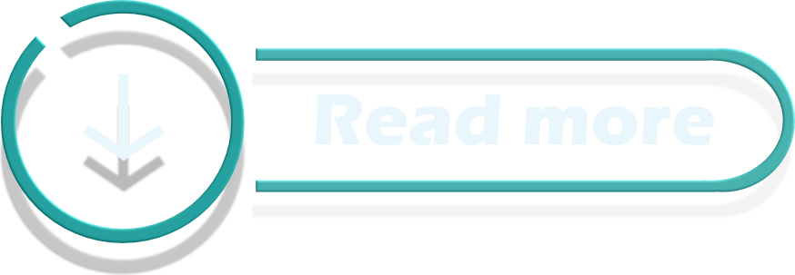

 <a href="../README.md">
  
</a>


# INSTALLATION GUIDE

```
File: Save without formating
```


## Sommaire


- [Get Started](#get-started)
  - [Installation](#installation)
  - [Material UI](#material-ui)
  - [Authentification Components](#authentification-components)
- [Backend avec Nest JS ](#backend-avec-nestjs)
  - [Introduction ](#introduction)
  - [Mise à niveau avec pnpm](#mise-à-niveau-avec-pnpm)
  - [Creation d'un workspace](#creation-dun-workspace-pour-simplifier-le-travail-sur-vscode)
  - [Erreurs de compatibilité windows en cascades](#erreurs-de-compatibilité-windows-en-cascades)
  - [Retour à NestJS](#retour-à-linstallation-nestjs)
  - [Preparer/Nettoyer NestJS](#preparernettoyer-nestjs)
  - [User Module](#user-module)
  - [User Controller](#user-controller)
  - [User Services](#user-services)
  - [DTO First steps](#dto-first-steps)
  - [CLASS VALIDATOR & CLASS TRANSFORMER](#class-validator--transformer)
  - [Add Pipes](#pipes)
  - [pnpm i nestjs/config](#nestjsconfig)
  - [.ENV](#env)


# Get Started

## Installation

- Pour commencer nous allons créer la base de notre projet en utilisant **NextJS**

```
npx create-next-app@14.1.0
```

- dans les étapes de création de nextjs voici celles que nous n'allons pas ajouter à notre projet ,

  - use `src/` directory? » No,
  - import alias (@/\*)? ... No

- Après l'installation nous allons simplement aller dans le dossier de notre projet

```
cd .\shoppy-ui\
```

- Puis nous directement lancer notre projet nextjs avec

```
npm run dev
```

- Ensuite nous allons "nettoyer" notre projet en supprimant le texte inutile par défaut de nextjs

### page.tsx :

```
export default function Home() {
  return (
    <>
    </>
  );
}
```

### globals.css :

```
@tailwind base;
@tailwind components;
@tailwind utilities;
```


## Material UI

- Nous allons maintenant installer tout le nécessaire pour notre Material UI avec les installations suivante

```
npm i --save @mui/material @emotion/react @emotion/styled @mui/material-nextjs @emotion/cache
```

- Puis nous allons dans **layout.tsx** qui gère la structure
- Pour rajouter **un nouvel import**

```
import { AppRouterCacheProvider } from "@mui/material-nextjs/v13-appRouter";
```

- qui va nous permettre d'envelopper le children de notre layout avec le cache de Material UI

```
    <AppRouterCacheProvider>
          {children}
    </AppRouterCacheProvider>
```

- Dans **App** nous allons ajouter un nouveau fichier

```
dark.theme.ts
```

- Puis nous allons rajouter à l'intérieur le code suivant afin de configurer le thème de notre application avec un mode sombre

```
"use client"

import { createTheme } from "@mui/material"

const darkTheme = createTheme({
    palette: {
        mode: "dark"
    }
});

export default darkTheme;
```

- Ensuite nous retournons dans **Layout.tsx** afin d'y ajouter notre dark theme ainsi que quelques autres elements :

- ne pas oublier l'import **@mui/material** qui ne semble pas vouloir se placer automatiquement

```
import { Container } from "@mui/material";
```

- Puis nous allons ajouter les elements suivants

```
<AppRouterCacheProvider>
    <ThemeProvider theme={darkTheme}>
       <CssBaseline />
        <Container>
              {children}
        </Container>
    </ThemeProvider>
</AppRouterCacheProvider>
```

- Mais à ce stade des erreurs surviennent car "use client" doit être utilisé pour couvrir la librairie **"@emotion/react"**

- Nous allons donc **isoler cette partie du code** afin de la placer dans un component séparé qui sera importé dans **Layout.tsx** et bénficiera de la directive **"use client"**

- **Creation du dossier components/ClientProviders.tsx** pour isoler la partie du code qui utilise la directive **"use client"**


## Authentification Components

- Nous allons créer pour l'authentification dans app le dossier **auth** dans lequel se trouveront le dossier **login** ainsi que le dossier **signup** , dans lesquels respectivement se trouveront les fichiers page.tsx avec la structure ( copié collé) de Home :

```
export default function Login() {
    return (
        <>
        </>
    );
}
```

- nous pouvosn ainsi vérifier que les routes sont disponibles à partir de l'url en écrivant le nom du dossier **auth/login** à la suite

- Ensuite dans le dossier auth nous allons créer un fichier layout.tsx qui contiendra la structure de base de nos pages d'authentification

```
import { Box } from "@mui/material"

export default function AuthLayout({
    children
}: {
    children: React.ReactNode
}) {
    return (
        <Box className="h-screen flex items-center justify-center">
            {children}
        </Box>
    )
}
```

- Puis nous allons créer notre composant de login avec la structure suivante :

```
import { Button, Link, Stack, TextField } from "@mui/material";
import NextLink from 'next/link'

export default function Login() {
    return (
        <Stack spacing={2} className="w-full max-w-xs">
            <TextField label="Email" variant="outlined" type="email" />
            <TextField label="Password" variant="outlined" type="password" />
            <Button variant="contained">
                Login
            </Button>
            <Link component={NextLink} href="/auth/signup"
                className="self-center"
            >
                Signup
            </Link>
        </Stack>
    );
}
```

- PS ne pas oublier d'utiliser l'import Link de material ui
- Pour eviter le probleme d'incompatibilité avec le paramètre component={NextLink}

```
import { Button, Link, Stack, TextField } from "@mui/material";
```

- Et enfin nosu allons ajouter la section signup en copiant ce qui se trouve dans login en inversant les liens de rediurections et en modifiant le nom du bouton d'action

```
export default function Signup() {
    return (
        <Stack spacing={2} className="w-full max-w-xs">
            <TextField label="Email" variant="outlined" type="email" />
            <TextField label="Password" variant="outlined" type="password" />
            <Button variant="contained">
                Signup
            </Button>
            <Link component={NextLink} href="/auth/login" className="self-center">
                Login
            </Link>
        </Stack>
    );
}
```

<a href="#sommaire"></a>


# Backend avec Nest.js

## Introduction

- Nous allons installer NestJS en utilisant le CLI dans le scope global

```
npm i -g @nestjs/cli@latest
```

- Puis dans notre repo dans le dossier code nous allons init notre backend

```
nest new shoppy-backend
```


## Mise à niveau avec pnpm

- Dans un premier temps nous allons vérifier que pnpm est disponible

```
pnpm --version
```

- Si pnpm n'est pas installé, nous allons l'installer

```
npm install -g pnpm
```

- Nous allons vérifier si l'installation à réussi

```
pnpm --version
```

- Une fois pnpm installé et reconnu, nous allons exécuter la commande suivante afin d'installer les dépendances :

```
pnpm install --strict-peer-dependencies=false
```

- à présent que pnpm est installé avec ses dépendances nous exécutons à nouveau la commande pour installer NestJS

```
nest new shoppy-backend
```

<a href="#sommaire"></a>

## Creation d'un workspace pour simplifier le travail sur vscode

### Où se situer pour faire "Add Folder to Workspace" ?

- Pas besoin de se déplacer dans le terminal :

- Ce processus ne dépend pas de notre position actuelle dans le projet.
- Ainsi nous pouvons lancer Visual Studio Code depuis n’importe où.

### Étapes détaillées :

- Lancer VS Code :

- Ouvre VS Code.
- Si tu vois une fenêtre avec un projet déjà ouvert, ce n'est pas grave.
- Ajouter les dossiers :

- Dans le menu en haut, clique sur File > Add Folder to Workspace.
- Navigue vers ton dossier code.
- Sélectionne le dossier shoppy-backend et clique sur Add.
- Répète la procédure pour le dossier shoppy-ui.

### Enregistrer l’espace de travail :

- Après avoir ajouté les deux dossiers :
- Va dans File > Save Workspace As....
- Enregistre ce fichier .code-workspace dans le dossier code :

```
shoppy.code-workspace
```

- Ouvrir l’espace de travail enregistré :

- Pour travailler plus tard, double-clique sur le fichier code-workspace que tu viens d’enregistrer.
  Cela rouvrira automatiquement shoppy-backend et shoppy-ui dans VS Code.

## Erreurs de compatibilité windows en cascades

- L'erreur suivante apparait à chaque page

```
Delete '␍' eslint(prettier/prettier)
```

### Pourquoi cette erreur se produit-elle ?

- Différence de fin de ligne :

Sous Windows, la fin de ligne est souvent configurée sur CRLF (carriage return + line feed).
Sous Linux/macOS, elle est généralement configurée sur LF (line feed seulement).
Votre configuration actuelle semble exiger LF, mais le code utilise CRLF, ce qui déclenche des erreurs.
ESLint avec Prettier :

La règle prettier/prettier d’ESLint impose un style spécifique pour les fichiers, y compris le type de fin de ligne.

<a href="../doc/readmore/rm_errors.md"></a>


## Retour à l'installation NestJS

- ce qui nous amène à une installation sans erreurs youpi ^^

- ensuite nous allons accéder à notre backend fraichement installé

```
cd .\shoppy-backend\
```

- Pour ouvrir le fichier main.js et **modifier le port 3001**

```
 await app.listen(process.env.PORT ?? 3001);
```

- Et e,nfin nous allons Lancer NESTjs

```
pnpm run start:dev
```

- Puis nous allons ouvrir **Postman**
- pour ouvrir une requete GET et y ajouter :

```
http://localhost:3001/
```

- Ce qui naturellement nous renvoie le `hello world` par defaut


## Preparer/Nettoyer NestJS

- Pour nettoyer NestJS, nous allons commencer par supprimer les fichiers **app.service.ts** et **app.controller.ts** puis **app.controller.sp...**

<a href="../doc/annexe/Nest_clean.md"></a>

- Puis nous allons nettoyer le module `app.module.ts`
- ATTENTION : Lors de la sauvegarde le formatage crée une erreur car entre {} il n'existe pas d'espace ; cependant le formatage automatique rajoute un espace

- Pour contre cet effet indésirable nosu allons faire `ctrl + shift + p` et selectionner `File: Save without formating` afi nde contourner ce problème

```
import { Module } from '@nestjs/common';
@Module({
  imports: [],
  controllers: [],
  providers: [],
})
export class AppModule {}
```

<a href="#sommaire"></a>


## USER MODULE

- Puis toujours dans le dossier backend nous allons rajouter :
- Les modules dans NestJS permettent de regrouper logiquement des fonctionnalités liées entre elles (ici, tout ce qui concerne les utilisateurs).

```
nest g module users
```

- message en terminal :

```
CREATE src/users/users.module.ts (86 bytes)
UPDATE src/app.module.ts (203 bytes)
```

- Ce qui va générer un dossier dans lequel se trouve

```
users.module.ts
```

- Contenant les lignes suivantes :

```
import { Module } from '@nestjs/common';
@Module({})
export class UsersModule {}
```

- Aussi nous remarquons que cete ajout à inséré de nouvelles lignes dans le fichier `app.module.ts` :
- Qui possède desormais un nouvel import :

```
@Module({
  imports: [UsersModule],
```

<a href="#sommaire"></a>


## USER CONTROLLER

- Cette commande génère un contrôleur pour gérer les routes relatives aux utilisateurs.

- Deux fichiers sont créés dans le dossier users :

  - users.controller.ts : contient les endpoints pour interagir avec le module utilisateur.
  - users.controller.spec.ts : fichier pour écrire des tests unitaires du contrôleur (optionnel à ce stade).

- Voici la commande pour créer notre controller

```
nest g controller users
```

- Ce qui va générer 2 fichiers `users.controller.spec.ts` et `users.controller.ts` dans le dossier `users`

### Objectif :

- Le contrôleur est responsable de gérer les requêtes HTTP entrantes et d'appeler les services pour effectuer des actions spécifiques (ex. : création, mise à jour d'utilisateur).

<a href="#sommaire"></a>


## USER SERVICES

- Cette commande génère un service dédié à la logique métier pour le module utilisateur.
- Deux fichiers sont créés dans le dossier users :
  - **users.service.ts** : contient la logique métier (par exemple, la gestion des utilisateurs).
  - **users.service.spec.ts** : fichier pour les tests unitaires du service (optionnel à ce stade).

```
nest g service users
```

- Ce qui va nous permettre d'ajouter deux fichiers `users.service.spec.ts` et `users.service.ts` dans le dossier `users`

### Objectif :

Les services encapsulent la logique métier (ex. : interactions avec la base de données, vérifications, transformations de données) pour rendre le contrôleur plus léger.

<a href="#sommaire"></a>


## DTO First steps

- Un DTO sert à définir clairement les données attendues dans une requête (par exemple, les champs obligatoires pour créer un utilisateur).
- Cela permet d'avoir un modèle standardisé et de valider les données entrantes.

- Nous allons donc ajouter DANS users.controller.ts le script suivant

```
import { Body, Controller, Post } from '@nestjs/common';

@Controller('users')
export class UsersController {

    @Post()
    createUser(@Body() request: ) {}
}
```

- et créer un dossier `dto` dans lequel nous allons ajouter un fichier `create-user.dto.ts`

```
create-user.request.ts
```

- Avec le contenu suivant

```
export class CreateUserRequest {
  email: string;
  password: string;
}
```

- Puis nous allons compléter `users.controller.ts` en ajoutant
- mais cela est encore sous erreur nosu allons donc **cliquer** sur **UserServices**

```
import { Body, Controller, Post } from '@nestjs/common';
import { CreateUserRequest } from './dto/create-user.request';
import { UsersService } from './users.service';

@Controller('users')
export class UsersController {
    constructor(private readonly usersService: UsersService)
  @Post()
  createUser(@Body() request: CreateUserRequest) {}
}
```

- Et enfin dans users.controller.ts voici le resultat final :

```
import { Body, Controller, Post } from '@nestjs/common';
import { CreateUserRequest } from './dto/create-user.request';
import { UsersService } from './users.service';

@Controller('users')
export class UsersController {
  constructor(private readonly usersService: UsersService) {}
  @Post()
  createUser(@Body() request: CreateUserRequest) {
    return this.usersService.createUser(request);
  }
}
```

### Ce qui se passe :

L'annotation @Body() extrait les données du corps de la requête HTTP.
Le DTO CreateUserRequest est utilisé pour typer et structurer ces données.

<a href="#sommaire"></a>


## CLASS VALIDATOR & TRANSFORMER

- Pour commencer nous allons ajouter de nouveaux imports

```
pnpm i --save class-validator class-transformer
```


## Pipes

- Nous allons rajouter dans `main.ts` la ligne suivante en placant en parametres whitelist: true:

` app.useGlobalPipes(new ValidationPipe({ whitelist: true }));`

```
import { NestFactory } from '@nestjs/core';
import { AppModule } from './app.module';
import { ValidationPipe } from '@nestjs/common';

async function bootstrap() {
  const app = await NestFactory.create(AppModule);
  app.useGlobalPipes(new ValidationPipe({ whitelist: true }));
  await app.listen(process.env.PORT ?? 3001);
}
bootstrap();

```

<a href="#sommaire"></a>


## @nestjs/config

- Puis nous allons installer **nestjs/config**

```
pnpm i --save @nestjs/config
```

- et nous allons aller dans **app.module.ts** pour ajouter dans les imports **ConfigModule.forRoot()**

```
import { Module } from '@nestjs/common';
import { UsersModule } from './users/users.module';
import { ConfigModule } from '@nestjs/config';

@Module({
  imports: [ConfigModule.forRoot(), UsersModule],
  controllers: [],
  providers: [],
})
export class AppModule {}
```

<a href="#sommaire"></a>


## .ENV

- Puis nous allons créer un fichier **.env** dans le dossier racine de notre projet avec les informations de connexion ; ici PORT = 3001

```
PORT= 3001
```

- Puis nous allons modifier **main.ts** ou nous allons remplacer la ligne du port 3001 par `await app.listen(app.get(ConfigService).getOrThrow('PORT'));`

```
import { NestFactory } from '@nestjs/core';
import { AppModule } from './app.module';
import { ValidationPipe } from '@nestjs/common';
import { ConfigService } from '@nestjs/config';

async function bootstrap() {
  const app = await NestFactory.create(AppModule);
  app.useGlobalPipes(new ValidationPipe({ whitelist: true }));
  await app.listen(app.get(ConfigService).getOrThrow('PORT'));
}
bootstrap();
```


<a href="#sommaire"></a>


